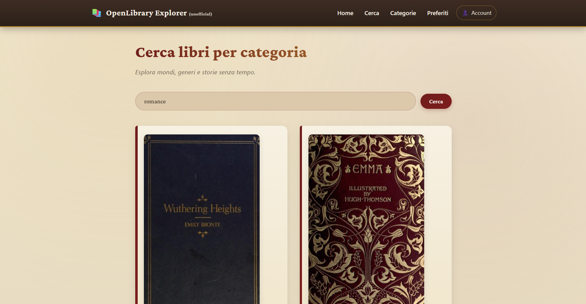

<a id="readme-top"></a>

<!-- PROJECT SHIELDS -->


<!-- PROJECT LOGO -->
<br />
<div align="center">
  <a href="https://antoniods1.github.io/html-open-library-angular">
    
  </a>

  <h3 align="center">Open Library Angular</h3>

  <p align="center">
    A modern Angular application to search books by category using the Open Library API.
    Built with standalone architecture, reactive state management, and clean UI design.
    <br />
    <a href="https://antoniods1.github.io/html-open-library-angular"><strong>Visit on GitHub Pages »</strong></a>
    <br />
    <a href="https://YOUR_FIREBASE_PROJECT.web.app"><strong>Visit on Firebase »</strong></a>
    <br /><br />
    <a href="https://github.com/AntonioDS1/html-open-library-angular/issues">Report Bug</a>
    ·
    <a href="https://github.com/AntonioDS1/html-open-library-angular/issues">Request Feature</a>
  </p>
</div>

---

## 📚 Overview



**Open Library Angular** is a modern Angular application that allows users to search books by category (fantasy, horror, romance, etc.) using the official Open Library API.

The project focuses on:

- standalone Angular architecture
- reactive state with RxJS
- facade pattern
- separation between smart and presentational components
- clean vintage-inspired UI
- real-world SEO and deploy practices

This is a **portfolio-grade Angular project**, designed to demonstrate architecture knowledge and clean frontend engineering.

<p align="right">(<a href="#readme-top">back to top</a>)</p>

---

## 🚀 Core Features

### 🔹 1. Search Books by Category
Users can search by subject (e.g., horror, fantasy, romance) using Open Library subjects endpoint.

### 🔹 2. Book Description Toggle
Click a book to load and display its full description dynamically.

### 🔹 3. Facade State Management
Uses a custom `BooksFacadeService` with:
- `BehaviorSubject`
- reactive streams
- separation between HTTP logic and UI state

### 🔹 4. Standalone Angular Architecture
No NgModules.
Fully standalone components with:
- `bootstrapApplication`
- `app.config.ts`
- modern Angular routing

### 🔹 5. Smart vs Presentational Pattern
Clear separation between:
- container components (HomePage)
- presentational components (BookCard, BooksList, BookDescription)

### 🔹 6. RxJS Reactive Flow
- Observables
- async pipe
- no manual change detection hacks
- clean subscription handling

### 🔹 7. SEO & Metadata Ready
- Open Graph
- Twitter Cards
- Canonical URL
- Schema.org JSON-LD

### 🔹 8. Responsive Design
Grid layout for books (e-commerce style)
Works across desktop, tablet, and mobile.

<p align="right">(<a href="#readme-top">back to top</a>)</p>

---

## 🛠️ Built With

- **Angular (Standalone API)**
- **TypeScript**
- **RxJS**
- **HTML5**
- **SCSS**
- **Open Library API**
- **Firebase Hosting**
- **GitHub Pages**

<p align="right">(<a href="#readme-top">back to top</a>)</p>

---

## 🏗️ Project Architecture

```
src/
 └── app/
     ├── core/
     │   ├── services/
     │   ├── models/
     │   └── interceptors/
     │
     ├── shared/
     │   ├── components/
     │   ├── pipes/
     │   └── directives/
     │
     └── features/
         └── books/
             ├── pages/
             ├── components/
             ├── services/
             └── store/
```

Architecture principles used:

- Feature-based structure
- Core for global singletons
- Shared for reusable UI
- Facade pattern for state orchestration
- Reactive UI via async pipe

<p align="right">(<a href="#readme-top">back to top</a>)</p>

---

## 🚀 Getting Started

### 1️⃣ Clone the repository

```bash
git clone https://github.com/AntonioDS1/html-open-library-angular.git
```

### 2️⃣ Install dependencies

```bash
npm install
```

### 3️⃣ Run locally

```bash
ng serve
```

App will run at:

```
http://localhost:4200
```

### 4️⃣ Build for production

```bash
ng build
```

### 5️⃣ Deploy to Firebase

```bash
firebase deploy
```

<p align="right">(<a href="#readme-top">back to top</a>)</p>

---

## 🌐 Live Links


### 🔹 Firebase Production

👉 https://html-open-library-angular.web.app

### 🔹 GitHub Repository

👉 https://github.com/AntonioDS1/html-open-library-angular

<p align="right">(<a href="#readme-top">back to top</a>)</p>

---

## 📬 Contact

**Antonio De Siena**

GitHub:

👉 https://github.com/AntonioDS1

Project Links:

👉 GitHub Repository: https://antoniods1.github.io/html-open-library-angular
👉 Firebase: https://html-open-library-angular.web.app

<p align="right">(<a href="#readme-top">back to top</a>)</p>
